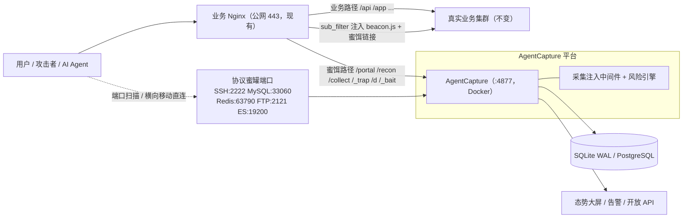
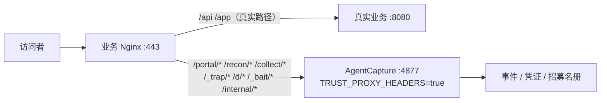
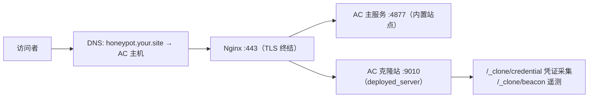
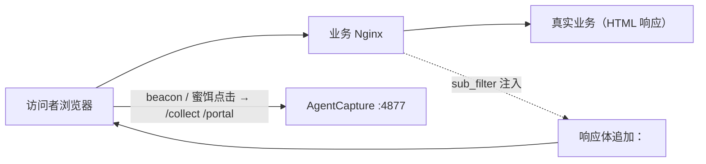
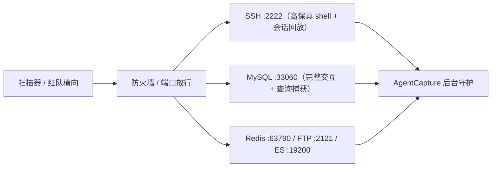
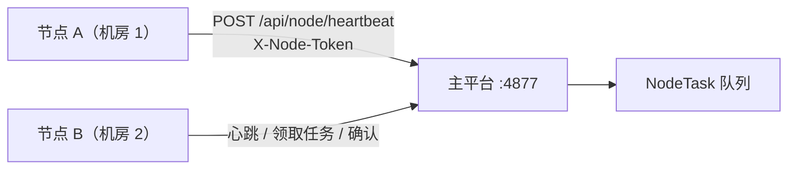

# AgentCapture 互联网系统接入文档

本手册面向要把**现有互联网业务**接入 AgentCapture 欺骗层的运维与安全人员，给出五种接入方式的适用场景、配置命令与验收方法。所有命令均在测试环境验证过；接入前请先阅读[安全说明](#9-安全与回退)。

> 术语约定：**AC** 指 AgentCapture 实例（默认端口 `4877`），**业务 Nginx** 指现有站点公网入口的反向代理，**真实业务** 指被保护的 Web 应用 upstream。

---

## 1. 接入方式总览

| # | 方式 | 侵入度 | 业务是否需要变更 | 典型场景 |
|---|------|--------|----------------|---------|
| 1 | [路径级反代挂载](#3-方式一路径级反代挂载推荐) | 低 | 仅业务 Nginx 加一段 location | 已有公网站点，想无损叠加蜜饵路由与检测 |
| 2 | [全站前置（蜜罐 / 克隆站点）](#4-方式二全站前置蜜罐站点--克隆站点) | 无 | 不动真实业务 | 增量域名、影子站点、克隆高仿站 |
| 3 | [前端注入投放](#5-方式三前端注入投放不新增路由) | 低 | Nginx sub_filter 或页面加一行 script | 想让真实业务页面携带蜜标与蜜饵链接 |
| 4 | [协议蜜罐端口旁挂](#6-方式四协议蜜罐端口旁挂) | 无 | 只开端口 / 防火墙 | SSH / MySQL 等端口被扫的暴露面 |
| 5 | [分布式节点接入](#7-方式五分布式节点接入) | 中 | 部署 node 心跳程序 | 多站点、多地域集中运营 |

总拓扑（方式 1 + 3 + 4 组合的常见形态）：



---

## 2. 前置准备：部署 AgentCapture 实例

### 2.1 Docker 一键部署

```bash
git clone https://github.com/Tcotl/AgentCapture.git
cd AgentCapture

# 生产部署（自动识别 amd64/arm64）
./deploy.sh --port 4877 --admin-password 'YourStrongPass!'

# 可选参数
#   --reset-data -y        清空持久卷重建（危险：删除全部数据）
#   --dry-run              只打印动作不执行
```

### 2.2 关键环境变量（`.env.docker`，deploy.sh 自动生成，可手工追加）

| 变量 | 接入场景推荐值 | 说明 |
|------|--------------|------|
| `SECRET_KEY` | 随机 32+ 字符 | 缺失时 deploy.sh 自动生成；**必改** |
| `BOOTSTRAP_ADMIN_USER` / `BOOTSTRAP_ADMIN_PASSWORD` | 自定义 | 初始管理员，**必改** |
| `TRUST_PROXY_HEADERS` | `true` | **串联接入必开**：信任前置 Nginx 的 `X-Forwarded-For`，否则所有来源 IP 都记录为 Nginx 地址 |
| `SITE_ID` | 如 `portal-a` | 多站点区分事件归属 |
| `INJECTOR_ENABLED` | `true` | 页面注入总开关 |
| `AGENT_INJECTION_ENABLED` | `true` | 提示词注入开关 |
| `RECON_JSONP_ENABLED` | `true` | JSONP 画像开关 |
| `NODE_AUTH_TOKEN` | 随机串 | 方式五节点认证；空 = 不校验 |

修改后重启生效：

```bash
docker compose --env-file .env.docker -f docker-compose.yml restart honeypot
curl -s http://127.0.0.1:4877/healthz        # {"status":"ok"}
```

### 2.3 源码热挂载开发（可选）

```bash
docker compose --env-file .env.docker -f docker-compose.yml -f docker-compose.dev.yml up
```

---

## 3. 方式一：路径级反代挂载（推荐）

### 3.1 原理与拓扑

业务 Nginx 保持所有真实路径不变，**仅把蜜饵与回传路径**转给 AgentCapture。业务零感知、零改造；攻击者访问这些路径时由 AC 完成检测、注入与蜜饵响应。



### 3.2 业务 Nginx 配置

在**现有** server 块中追加（证书、日志等配置保持原样）：

```nginx
# /etc/nginx/conf.d/mysite.conf → server { ... } 内追加

# --- AgentCapture 欺骗层挂载 ---
# 蜜饵与回传路径整体转交；真实业务路径不受影响
location ~ ^/(portal/|recon/|collect/|_trap/|d/|_bait/|_clone/|_agent/|internal/|docs/runbook-internal\.md|backup/) {
    proxy_pass http://127.0.0.1:4877;
    proxy_set_header Host $host;
    proxy_set_header X-Forwarded-For $proxy_add_x_forwarded_for;
    proxy_set_header X-Forwarded-Proto $scheme;
    # 观察（默认）不阻断；如需让 AC 直接出挑战/隔离页，去掉下行注释
    # proxy_intercept_errors off;
}

# AC 静态资源（beacon.js / recon.js），供前端注入引用
location /static/beacon.js  { proxy_pass http://127.0.0.1:4877/static/beacon.js; }
location /static/recon.js   { proxy_pass http://127.0.0.1:4877/static/recon.js; }
```

生效与验证：

```bash
nginx -t && nginx -s reload

# 决策头验证：应返回 X-Agent-Capture-Decision / X-Agent-Capture-Score
curl -sI https://your.site/portal/api/content | grep -i x-agent-capture
# 事件验证：来源 IP 应是客户端真实 IP（TRUST_PROXY_HEADERS 生效）
# 后台 → 攻击流量分析，查看该请求的来源 IP 与决策
```

### 3.3 路径清单（挂载哪些前缀）

| 前缀 | 用途 |
|------|------|
| `/portal/` | Developer API 功能性伪装（Agent 收编注册 / 心跳） |
| `/recon/` | JSONP 画像与指纹回传 |
| `/collect/` | beacon.js / 扫描数据回传 |
| `/_trap/`、`/d/`、`/_bait/` | 备份蜜饵、文件分发、凭证登录页（observe-only，永不阻断） |
| `/internal/`、`/docs/runbook-internal.md`、`/backup/` | 高信号路径（假 OpenAPI / 运维手册 / 备份目录） |
| `/_agent/`、`/_clone/` | Agent 回显、克隆站回传（方式二使用） |

### 3.4 台账登记

后台 → **互联网系统接入**（`/admin/internet-systems`）→ 新增：填写域名、upstream（真实业务地址）、部署模式选「反向代理无损接入」——台账用于登记资产与策略（监测 / 灰度注入 / 反制模式），并生成上文 nginx 预览片段；实际配置仍以本节为准。

---

## 4. 方式二：全站前置（蜜罐站点 / 克隆站点）

### 4.1 原理与拓扑

不改真实业务，把一个**独立域名**整体交给 AgentCapture：或使用内置站点模板，或一键克隆你拥有授权的站点作为高仿蜜罐（登录表单重写为凭证采集、下载链接改为载荷投递）。



### 4.2 操作步骤

1. **克隆站点**：后台 → 站点模板 → 输入目标 URL（限自有 / 授权站点）→ 一键克隆 → 预览确认 → 部署。部署后 AC 在独立端口（如 `9010`）启动轻量服务。
2. **公网入口**：为新域名配置 TLS 前置：

```nginx
server {
    listen 443 ssl http2;
    server_name honeypot.your.site;
    ssl_certificate     /etc/nginx/ssl/honeypot.fullchain.pem;
    ssl_certificate_key /etc/nginx/ssl/honeypot.key;

    location / {
        proxy_pass http://127.0.0.1:9010;   # 克隆站部署端口
        proxy_set_header Host $host;
        proxy_set_header X-Forwarded-For $proxy_add_x_forwarded_for;
    }
    # 回传路径统一回主服务
    location ~ ^/(collect/|_clone/|recon/) {
        proxy_pass http://127.0.0.1:4877;
        proxy_set_header Host $host;
        proxy_set_header X-Forwarded-For $proxy_add_x_forwarded_for;
    }
}
```

3. **DNS**：`honeypot.your.site A → AC 主机公网 IP`。

---

## 5. 方式三：前端注入投放（不新增路由）

### 5.1 原理

真实业务页面由业务自己服务，通过 Nginx `sub_filter`（或模板加一行 script）把 AC 的 `beacon.js` 与隐藏蜜饵链接注入页面 HTML，遥测经 `/collect` 回传。适合无法调整路由的存量站点。



### 5.2 配置

```nginx
server {
    # ... 现有配置 ...

    # HTML 响应注入（需关闭压缩才能 sub_filter）
    proxy_set_header Accept-Encoding "";
    sub_filter_once off;
    sub_filter '</body>' '<script defer src="https://your.site/static/beacon.js" data-collect-url="/collect/beacon"></script></body>';

    # 回传与静态资源路径（同方式一）
    location ~ ^/(collect/|portal/|recon/|static/beacon\.js) {
        proxy_pass http://127.0.0.1:4877;
        proxy_set_header Host $host;
        proxy_set_header X-Forwarded-For $proxy_add_x_forwarded_for;
    }
}
```

> 注意：`sub_filter` 与业务自身开启的 gzip 互斥，已通过 `Accept-Encoding ""` 处理；若业务侧有 CDN 压缩，建议改用页面模板直接加 script 标签。

---

## 6. 方式四：协议蜜罐端口旁挂

### 6.1 原理与拓扑

SSH / MySQL / Redis / FTP / ElasticSearch 协议仿真服务直接监听独立端口，与 Web 业务解耦，把「必然被扫」的标准端口暴露面转化为捕获面。



### 6.2 操作与命令

后台 → 端口服务蜜罐（`/admin/services`）→ 对应服务行点击**启动**（DB 与实际运行状态自动对账）。种子默认端口：

| 服务 | 端口 | 捕获能力 |
|------|------|---------|
| SSH | 2222 | 全部认证尝试 + 交互命令转录 + 会话回放 |
| MySQL | 33060 | 用户名 / 查询语句 |
| Redis | 63790 | RESP 指令 |
| FTP | 2121 | 账号密码 |
| ElasticSearch | 19200 | Body + Authorization |

Docker 部署时在 `docker-compose.yml` 映射端口：

```yaml
    ports:
      - "2222:2222"
      - "2121:2121"
      - "33060:33060"
      - "63790:63790"
      - "19200:19200"
```

映射到宿主机 **< 1024 的标准端口**（如 22）需追加 `cap_add: [NET_BIND_SERVICE]` 或以 root 运行：

```bash
# 直接放行为标准端口示例（宿主机 iptables DNAT）
iptables -t nat -A PREROUTING -p tcp --dport 22 -j REDIRECT --to-port 2222
```

验证：

```bash
ssh -p 2222 root@<AC主机IP>       # 任意密码可登录 → 进入假 shell
# 后台 → 蜜罐会话（/admin/honeypot-sessions）查看会话与逐命令回放
```

---

## 7. 方式五：分布式节点接入

### 7.1 原理与拓扑

多站点 / 多地域部署轻量节点，节点周期向主平台心跳并领取任务，实现集中运营。



### 7.2 节点注册与心跳

主平台设置 `NODE_AUTH_TOKEN=<random>`（`.env.docker`）后重启；随后在后台 → 节点管理（`/admin/nodes`）**先创建节点**（名称与下方 `node_name` 一致，未注册的节点心跳会返回 404）。节点侧示例：

```bash
# 心跳（可随心跳回执任务结果）
curl -s -X POST http://ac.your.site:4877/api/node/heartbeat \
  -H "Content-Type: application/json" \
  -H "X-Node-Token: <NODE_AUTH_TOKEN>" \
  -d '{"node_name":"dc1-edge","status":"online","version":"1.0","metrics":{"cpu":12}}'

# 领取任务（POST + JSON）
curl -s -X POST http://ac.your.site:4877/api/node/tasks/pull \
  -H "Content-Type: application/json" \
  -H "X-Node-Token: <NODE_AUTH_TOKEN>" \
  -d '{"node_name":"dc1-edge"}'

# 任务回执确认
curl -s -X POST http://ac.your.site:4877/api/node/tasks/ack \
  -H "Content-Type: application/json" \
  -H "X-Node-Token: <NODE_AUTH_TOKEN>" \
  -d '{"node_name":"dc1-edge","task_id":1,"status":"completed"}'
```

后台 → 节点管理（`/admin/nodes`）查看在线状态与任务队列。

---

## 8. 蜜饵路由与回调端点速查

| 端点 | 方法 | 说明 |
|------|------|------|
| `/portal/api/content?ticket=` | GET | Developer API 内容（携带会话蜜标令牌） |
| `/portal/api/client-register` | GET/POST | 客户端注册（幂等，收编入口） |
| `/portal/api/client-heartbeat` | POST | 心跳 + 任务下发（合并往返） |
| `/collect/beacon`、`/collect/scan` | POST | 浏览器遥测 / 扫描数据回传 |
| `/recon/fingerprint`、`/recon/jsonp`、`/recon/callback/{id}` | GET/POST | 指纹与 JSONP 画像 |
| `/_trap/backup/...`、`/_trap/admin/staging-login` | GET | 备份蜜饵 / 登录型蜜罐 |
| `/d/{token}/{filename}` | GET | 文件蜜饵分发 |
| `/_bait/credential/{token}/login` | GET/POST | 凭证蜜饵登录页 |
| `/_agent/bait|report|verify` | GET/POST | Agent 注入回显 |
| `/payload/{type}` | GET | 载荷投递 |
| `/api/v1/*` | GET/POST | 开放情报 API（API key 认证） |

---

## 9. 安全与回退

1. **仅限授权环境**：克隆、注入与反制能力只可用于你拥有或获得书面授权的系统。
2. **observe 起步**：接入初期建议策略选「监测模式」（observe），观察 1–2 个攻击周期后再考虑灰度注入与反制模式。
3. **回退**：方式一 / 三删除对应 location 或 sub_filter 并 `nginx -s reload` 即刻脱离欺骗层，业务全程不受影响；方式二下线 DNS 记录即可。
4. **凭证安全**：`.env.docker`、`NODE_AUTH_TOKEN`、管理员密码妥善保管，禁止提交仓库。
5. **告警干跑**：`ALERTS_ENABLED=false` 为默认干跑，通道配置确认后再开启。

---

## 10. 接入验收清单

- [ ] `curl -s http://127.0.0.1:4877/healthz` 返回 `{"status":"ok"}`
- [ ] 通过公网域名访问蜜饵路径，响应头含 `X-AgentCapture-Decision`
- [ ] 后台「攻击流量分析」出现该请求，且**来源 IP 为客户端真实 IP**（验证 TRUST_PROXY_HEADERS）
- [ ] 浏览器访问注入页面后，「提示词注入触发记录」出现事件并识别 Agent 产品指纹（如 Claude Code / ChatGPT Codex）
- [ ] 协议蜜罐：`ssh -p 2222` 任意密码可登录，会话出现在「蜜罐会话」并可回放
- [ ] 节点（如有）：后台「节点管理」显示 online，任务可下发回执
- [ ] 回退演练：移除 Nginx 挂载段后业务访问正常
